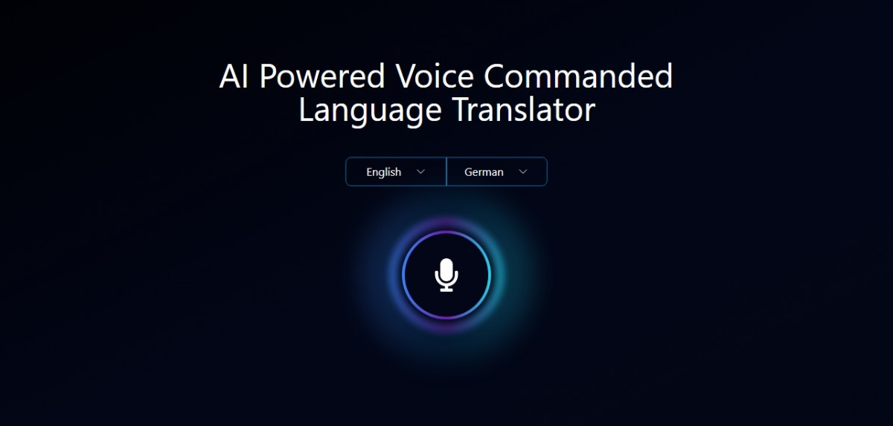

# AI Powered Voice Commanded Language Translator

This project features a voice-activated language translator built using React, Tailwind CSS, and browser APIs. It listens to user input through speech recognition, translates it to another language, and provides a smooth animated output.

## Table of Contents
- [Overview](#overview)
    - [Screenshot](#screenshot)
    - [Links](#links)

- [Tech Stack](#tech-stack)
- [Features](#tech-stack)
- [Author](#author)

## Overview

### Screenshot

### Links
- Code URL: [Github Repo.](https://github.com/mzwabantu/ai-translator)
- Live Site URL: [Ai Transalator](https://ai-translator.mzwwwa.co.za/)

## Tech stack
- React
- Tailwind CSS
- TypeScript
- Browser SpeechRecognition API
- Fetch API for backend communication

## Features
- Voice Command Input:
    Uses speech recognition to capture user input in the selected source language.

- Language Translation:
    Translates text to a target language through an API request.

- Animated Text Display:
    A typing animation simulates dynamic output for both input and translated text.

- Dark Mode Support:
    Adapts styles based on the user’s light or dark mode preferences.

- Multi-Language Support:
    The app allows users to select both source and target languages.

## Author

- Website - [Mzwabantu](https://mzwwwa.co.za/)
- LinkedIn - [mzwabantungubelanga](https://za.linkedin.com/in/mzwabantungubelanga)
- Dribbble - [MzwaN](https://dribbble.com/MzwaN)